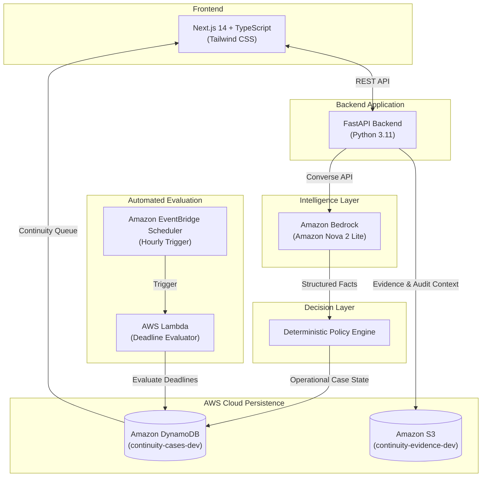

<div align="center">

# CONTINUITY — Workplace Handoff Intelligence

> **"Make sure important work survives the handoff."**

CONTINUITY is an AI-powered operational continuity engine that turns messy workplace handoffs into structured, accountable work by surfacing unresolved tasks, commitments, blockers, deadlines, and exceptions before they disappear between owners.

[](https://nextjs.org/)
[](https://www.typescriptlang.org/)
[](https://fastapi.tiangolo.com/)
[](https://aws.amazon.com/bedrock/)
[](https://aws.amazon.com/bedrock/)
[](https://aws.amazon.com/dynamodb/)
[](https://aws.amazon.com/s3/)
[](https://aws.amazon.com/lambda/)
[](https://aws.amazon.com/eventbridge/)

</div>

---

## The Problem

Work routinely moves from one employee to another, but the critical context surrounding that work is severely fragmented.

Important operational context is scattered across:
- Slack, Teams, and WhatsApp messages
- Email threads and forwards
- Spreadsheets and PDFs
- Ticket comments
- Personal scratch notes
- Verbal hallway conversations

The incoming owner should not have to reconstruct the state of work manually. When taking over, they need immediate, clear answers:
- **What was completed?**
- **What remains unresolved?**
- **What was promised to clients or stakeholders?**
- **What deadlines exist?**
- **What is blocking progress?**
- **What exceptions occurred?**
- **What should happen next?**

### Example: Unstructured Text to Operational State

An outgoing engineer writes in a chat channel:

> *"Payment API is complete. Webhook handling is still pending. Finance hasn't approved the discount. I promised the client the revised version before Friday. Follow up with Finance and finish webhook validation."*

The raw facts exist, but their operational status is buried inside text. CONTINUITY extracts and structures the state:

| Signal | Extracted Operational State |
| :--- | :--- |
| **Completed** | Payment API integration |
| **Unresolved** | Webhook handling |
| **Commitment** | Revised version promised to client before Friday |
| **Blocker** | Finance discount approval pending |
| **Next Action** | Follow up with Finance and finish webhook validation |
| **Deadline** | Friday |

---

## The Solution

CONTINUITY is **not**:
- A generic conversational chatbot
- A task manager or Jira clone
- A simple text summarizer
- A Slack replacement

Instead, CONTINUITY operates as an **operational continuity layer** between outgoing and incoming ownership.

> ### 🛡️ Core Principle
> **AI EXTRACTS. CODE DECIDES.**

### AI Extracts and Explains
Amazon Bedrock with **Amazon Nova 2 Lite** processes unstructured handoff information and extracts structured facts:
- Completed work items
- Unresolved work items
- Commitments & external promises
- Blockers & dependencies
- Deadlines (explicit and relative)
- Operational exceptions
- Recommended next actions

### Deterministic Code Decides and Enforces
The **Policy Engine** evaluates those extracted facts using deterministic business rules and assigns unambiguous operational states:
- `UNRESOLVED`
- `AT_RISK`
- `BLOCKED`
- `EXCEPTION`
- `OVERDUE`
- `RESOLVED`

The AI model parses and structures human language. Deterministic application code decides the operational status.

---

## How It Works

```
01 INGESTION ──► 02 EVIDENCE (S3) ──► 03 AI EXTRACTION ──► 04 POLICY ENGINE ──► 05 QUEUE ──► 06 AUDIT
```

### 01 — Ingestion
Messy handoff notes, briefs, or conversation dumps enter CONTINUITY without requiring the outgoing employee to fill out complex forms.

### 02 — Evidence Preservation
The original handoff evidence is stored in Amazon S3 (`continuity-evidence-dev`), ensuring the extracted operational state remains permanently traceable to its source.

### 03 — AI Extraction
Amazon Bedrock with Amazon Nova 2 Lite (`global.amazon.nova-2-lite-v1:0`) converts unstructured information into validated, structured facts.

### 04 — Policy Evaluation
The deterministic Policy Engine evaluates deadlines, active blockers, unresolved work, and commitments to assign case status and priority.

### 05 — Continuity Queue
The incoming owner receives prioritized operational cases in their queue instead of deciphering raw chat logs and email threads.

### 06 — Resolution & Audit
Cases can be resolved, reassigned, or escalated. Every status transition, action, and decision is recorded chronologically in the immutable audit trail.

---

## Architecture



### Component Breakdown

| Component | Technology | Purpose |
| :--- | :--- | :--- |
| **Frontend** | Next.js 14, TypeScript, Tailwind CSS | Polished B2B SaaS interface, queue views, and case inspection |
| **Backend** | FastAPI, Python 3.11, Pydantic v2 | API orchestration, extraction routing, and case lifecycle management |
| **AI Extraction** | Amazon Bedrock (Amazon Nova 2 Lite) | Real-time extraction of commitments, blockers, deadlines, and actions |
| **Decision Layer** | Deterministic Policy Engine | Code-based operational status enforcement (`AT_RISK`, `OVERDUE`, `BLOCKED`) |
| **Operational State** | Amazon DynamoDB | Case storage, status updates, and chronological audit trail |
| **Evidence Store** | Amazon S3 | Secure archive of original handoff source evidence |
| **Deadline Automation** | AWS Lambda + Amazon EventBridge Scheduler | Background deadline monitoring and automated status transitions |

---

## Built on AWS

CONTINUITY is built natively on AWS services executing core production logic:

- **Amazon Bedrock**: Powers live AI inference using **Amazon Nova 2 Lite** (`global.amazon.nova-2-lite-v1:0`) in `ap-south-1` via the Bedrock Runtime Converse API.
- **Amazon DynamoDB**: Provides millisecond persistence for continuity cases, operational state, handoffs, and audit records in `continuity-cases-dev`.
- **Amazon S3**: Preserves original handoff evidence in `continuity-evidence-dev` with structured, predictable object keys (`cases/{case_id}/evidence/{evidence_id}.txt`) and metadata preservation.
- **AWS Lambda**: Runs the serverless deadline evaluator (`continuity-deadline-evaluator-dev`) to scan cases and transition statuses based on elapsed deadlines.
- **Amazon EventBridge Scheduler**: Triggers recurring automated evaluation of active cases via `continuity-deadline-evaluation-schedule`.

> CONTINUITY uses AWS as part of the actual application flow, not merely as a listed technology.

---

## AI Extracts. Code Decides.

This architectural separation is a core differentiator of CONTINUITY:

| Layer | Responsibility |
| :--- | :--- |
| **Amazon Nova 2 Lite** | Extract structured facts from messy human context |
| **Pydantic / Structured Models** | Validate and enforce data types and constraints |
| **Policy Engine** | Apply deterministic operational rules |
| **Case State** | Store the resulting operational status |
| **Audit Trail** | Preserve what happened, why, and when |

- **The model handles ambiguity in language**: It reads messy notes, recognizes that *"before Friday"* represents a deadline, and identifies that *"Finance hasn't approved the discount"* is a blocking dependency.
- **The application handles operational decisions**: The Policy Engine evaluates if the blocker is active &rarr; sets status to `BLOCKED`. It checks if the deadline is approaching &rarr; sets status to `AT_RISK`.
- **Result**: Probabilistic AI is kept strictly separate from deterministic workflow enforcement, eliminating hallucinated business decisions.

---

## Core Concepts

| Concept | Meaning |
| :--- | :--- |
| **Handoff** | Transfer of work context between outgoing and incoming owners |
| **Continuity Case** | Operational unit created from a handoff with defined ownership and status |
| **Commitment** | Explicit promise or deliverable expected by a customer or stakeholder |
| **Blocker** | Dependency or condition preventing forward progress |
| **Exception** | Conflict or discrepancy between expected and observed state |
| **Evidence** | Original source material in S3 behind all extracted facts |
| **Policy Engine** | Deterministic evaluator that enforces operational case state |
| **Audit Trail** | Append-only historical record of case activity and transitions |

---

## Product Flow

- **Dashboard / My Work**: High-level operational overview featuring summary KPI cards (`UNRESOLVED`, `AT RISK`, `OVERDUE`, `BLOCKED`), architecture breakdown (*"AI EXTRACTS. CODE DECIDES."*), and active case cards.
- **Create Handoff**: Operational intake screen where outgoing employees provide unstructured notes, select incoming owners, and initiate case creation.
- **Handoff Processing**: Transparent 6-stage operational pipeline visualizing S3 archiving, Nova 2 Lite extraction, policy evaluation, and case generation.
- **Continuity Queue**: Incoming owner workspace with status tabs (`ALL`, `OVERDUE`, `AT RISK`, `BLOCKED`, `UNRESOLVED`, `RESOLVED`), real-time search, and priority indicators.
- **Case Detail**: Comprehensive 9-section operational record showing what happened, completed deliverables, unresolved items, commitments, blockers, exceptions, immediate next action, interactive S3 evidence viewer modal, and the chronological audit trail.

---

## Verified Implementation

The implementation is verified and operational:

| Verification Area | Status | Evidence |
| :--- | :---: | :--- |
| **Backend Test Suite** | Passed | 28 automated tests passed, 0 failures, 2 optional offline skips |
| **Frontend Production Build** | Passed | `npm run build` completed successfully (7/7 routes) |
| **Amazon Bedrock Inference** | Verified | Live Nova 2 Lite inference verified in `ap-south-1` via Converse API |
| **Amazon DynamoDB Persistence** | Verified | Verified on `continuity-cases-dev` |
| **Amazon S3 Evidence Storage** | Verified | Upload, key generation, and modal readback verified on `continuity-evidence-dev` |
| **End-to-End Handoff Flow** | Verified | Raw context &rarr; Bedrock Nova 2 Lite &rarr; Policy Engine &rarr; Case &rarr; Queue &rarr; S3 Evidence |
| **Operational Status Assignment** | Verified | Assigned deterministically by the Policy Engine |

---

## Tech Stack

| Layer | Technology |
| :--- | :--- |
| **Frontend** | Next.js 14, TypeScript, Tailwind CSS |
| **Backend** | Python 3.11, FastAPI, Pydantic v2, Uvicorn, Boto3 |
| **AI** | Amazon Bedrock, Amazon Nova 2 Lite (`global.amazon.nova-2-lite-v1:0`) |
| **Database** | Amazon DynamoDB (`continuity-cases-dev`) |
| **Evidence Storage** | Amazon S3 (`continuity-evidence-dev`) |
| **Scheduling** | Amazon EventBridge Scheduler |
| **Compute** | AWS Lambda (`continuity-deadline-evaluator-dev`) |
| **Icons / UI** | Lucide React (`lucide-react`), `clsx`, `tailwind-merge` |

---

## Getting Started

### Prerequisites

- **Node.js**: v18.0.0 or higher
- **Python**: v3.11 or higher
- **AWS CLI**: Authenticated with access to Bedrock, DynamoDB, and S3 in `ap-south-1`.

### Backend Setup

```bash
cd backend

# Create and activate virtual environment
python -m venv venv

# Windows
.\venv\Scripts\activate

# macOS/Linux
source venv/bin/activate

# Install dependencies
pip install -r requirements.txt

# Run the FastAPI server
python -m uvicorn app.main:app --port 8000 --reload
```

Backend will be available at `http://localhost:8000` (API documentation at `http://localhost:8000/docs`).

### Frontend Setup

```bash
cd frontend

# Install dependencies
npm install

# Run development server
npm run dev
```

Frontend will be available at `http://localhost:3000`.

---

## Environment Variables

Configuration is managed via `.env` (refer to `.env.example` in the repository root):

```env
# AI Provider Configuration
AI_PROVIDER=bedrock
BEDROCK_MODEL_ID=global.amazon.nova-2-lite-v1:0
AWS_REGION=ap-south-1

# Persistence Configuration
REPOSITORY_PROVIDER=dynamodb
DYNAMODB_TABLE=continuity-cases-dev

# Evidence Storage Configuration
EVIDENCE_PROVIDER=s3
S3_BUCKET=continuity-evidence-dev
S3_PREFIX=cases

# Application Settings
ENVIRONMENT=development
LOG_LEVEL=info
NEXT_PUBLIC_API_URL=http://localhost:8000
```

> **Security Note:** Never commit AWS credentials, access keys, secret keys, or private environment files to git. AWS authentication is handled via the standard AWS credential chain (`~/.aws/credentials`, IAM roles, or environment variables).

*(Note: For local offline development or testing without AWS access, set `AI_PROVIDER=mock`, `REPOSITORY_PROVIDER=memory`, and `EVIDENCE_PROVIDER=memory`.)*

---

## Project Structure

```text
Continuity---Handoff/
├── .env.example                     # Environment template (no secrets)
├── .gitignore                       # Git ignore rules for node_modules, build, secrets
├── README.md                        # Project documentation
├── backend/
│   ├── app/
│   │   ├── ai/                      # Bedrock Nova 2 Lite provider & factory
│   │   ├── api/                     # FastAPI endpoints (cases, handoff, queue, health, deadlines)
│   │   ├── evidence/                # S3 evidence preservation service
│   │   ├── handlers/                # AWS Lambda deadline evaluator handler
│   │   ├── models/                  # Domain models, schemas, and enums
│   │   ├── policy/                  # Deterministic Policy Engine
│   │   ├── repositories/            # DynamoDB repository & factory
│   │   └── services/                # Handoff, Case, and Deadline domain services
│   ├── scripts/                     # AWS verification, seeding, and smoke tests
│   ├── tests/                       # Automated unit and integration test suite
│   ├── requirements.txt             # Python backend dependencies
│   └── verify_aws.py                # AWS connectivity verification script
├── frontend/
│   ├── app/
│   │   ├── cases/[id]/              # 9-section Case Detail view with S3 Evidence modal
│   │   ├── handoff/new/             # Operational handoff intake screen
│   │   ├── handoff/processing/      # 6-stage visual pipeline screen
│   │   ├── queue/                   # Continuity Queue with filtering and search
│   │   ├── layout.tsx               # Root application layout
│   │   └── page.tsx                 # Executive dashboard with KPI summary cards
│   ├── components/                  # Navbar, CaseCard, SummaryCard, StatusBadge, ActionModal
│   ├── lib/                         # API client and helper utilities
│   ├── package.json                 # Next.js dependencies and build scripts
│   └── tailwind.config.js           # Design system tokens and styling
└── infrastructure/
    ├── eventbridge-schedule.json    # EventBridge Scheduler configuration
    ├── lambda-dynamodb-policy.json  # IAM policy for Lambda DynamoDB access
    ├── lambda-trust-policy.json     # IAM trust policy for Lambda
    ├── scheduler-invoke-policy.json # IAM policy for EventBridge Lambda invocation
    └── scheduler-trust-policy.json  # IAM trust policy for EventBridge
```

---

## AI Tools Used

- **Google Antigravity** — Used during development for assisted implementation, code generation, architectural validation, testing workflows, and frontend refinement.

---

## Demo

**🎥 Demo Video:** [YouTube link — add before submission]

> The demo shows a real handoff moving through Amazon Bedrock Nova 2 Lite extraction, deterministic policy evaluation, Continuity Queue creation, case inspection, and S3-backed evidence verification.

---
## Live Link 

**Project Live on Amplify :** [https://main.d2knkzd891upjq.amplifyapp.com/]

---
## Team — Court of Owls

- **Yukesh A** — Team Lead
- **Ragul M**
- **Kabilesh M**
- **Siva S**

---

## Built for First Commit

**CONTINUITY** was built for **First Commit**, part of the **Bharat Builds Tour** by **WeMakeDevs** in collaboration with **AWS**.
